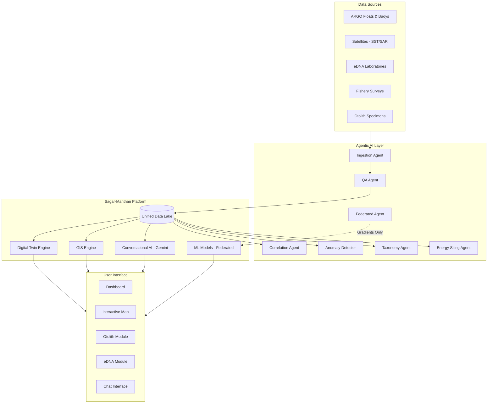

<div align="center">

# 🌊 Sagar-Manthan

### Deep Ocean Data Analytics

**India's First AI-Driven Unified Platform for Oceanographic, Fisheries & Molecular Biodiversity Intelligence**

*Built by **Team Orbit** for SIH2026 Internal Hackthon*

[](https://react.dev)
[](https://vitejs.dev)
[](https://ai.google.dev)
[](LICENSE)

---

*"Churning the ocean of data to surface actionable intelligence for India's Blue Economy"*

</div>

---

## 📋 Table of Contents

- [The Problem](#-the-problem)
- [Our Solution](#-our-solution--sagar-manthan)
- [What Makes Us Unique (USPs)](#-what-makes-us-unique-usps)
- [What No One Has Built Before](#-what-no-one-has-built-before)
- [How It Helps the Government](#-how-it-helps-the-government)
- [Platform Features](#-platform-features)
- [Architecture](#-architecture)
- [Tech Stack](#-tech-stack)
- [Getting Started](#-getting-started)
- [Environment Variables](#-environment-variables)
- [Team Orbit](#-team-orbit)

---

## 🔴 The Problem

India possesses the **7th largest Exclusive Economic Zone (EEZ)** in the world — 2.37 million km² of ocean territory — yet its marine data infrastructure suffers from critical fragmentation:

| Challenge | Impact |
|-----------|--------|
| **Siloed Data Systems** | INCOIS, CMLRE, Fishery Survey of India, NIOT, and state fisheries departments each maintain independent databases with incompatible formats |
| **No Unified Analytics** | There is no single platform where oceanographic data (currents, temperature, salinity), fisheries data (catch, species, migration), and molecular biodiversity data (eDNA) can be queried together |
| **Manual Processes** | Species identification relies on manual taxonomy; data validation is labor-intensive |
| **Energy-Biodiversity Conflict** | India targets 30 GW offshore renewable energy by 2030, but there is no systematic tool to assess environmental impact of proposed marine energy installations |
| **Data Privacy Barriers** | Research institutes resist sharing raw biodiversity data due to sovereignty concerns, preventing collaborative model training |

**Bottom line:** India is sitting on an ocean of data but drowning in fragmentation.

---

## 💡 Our Solution — Sagar-Manthan

**Sagar-Manthan** (सागर-मंथन, "Churning of the Ocean") is an AI-driven unified platform that integrates India's ocean data ecosystem into a single intelligence layer. It combines:

```
┌──────────────────────────────────────────────────────────────────┐
│                        SAGAR-MANTHAN                             │
│                                                                  │
│  ┌──────────┐  ┌───────────┐  ┌──────────┐  ┌──────────────┐   │
│  │Oceano-   │  │ Fisheries │  │ Molecular│  │Marine Energy │   │
│  │graphic   │◄─┤   Data    │◄─┤Biodiver- │◄─┤  Siting &    │   │
│  │ Sensing  │  │           │  │  sity    │  │Digital Twin  │   │
│  └────┬─────┘  └─────┬─────┘  └────┬─────┘  └──────┬───────┘   │
│       │              │             │               │            │
│       └──────────────┴─────────────┴───────────────┘            │
│                          │                                       │
│                ┌─────────▼──────────┐                            │
│                │  Agentic AI Layer  │                            │
│                │ (Autonomous Agents)│                            │
│                └─────────┬──────────┘                            │
│                          │                                       │
│           ┌──────────────┼──────────────┐                       │
│           ▼              ▼              ▼                       │
│    ┌──────────┐  ┌───────────┐  ┌──────────────┐               │
│    │ GIS Map  │  │Conversati-│  │ Reports &    │               │
│    │Dashboard │  │onal AI    │  │ Policy Recs  │               │
│    └──────────┘  └───────────┘  └──────────────┘               │
└──────────────────────────────────────────────────────────────────┘
```

---

## 🏆 What Makes Us Unique (USPs)

### 1. 🤖 Agentic AI Pipeline — Not Just a Dashboard
Unlike traditional ocean data portals that are passive visualization tools, Sagar-Manthan uses **autonomous AI agents** that actively:
- **Ingest & normalize** data from heterogeneous sources (buoys, ARGO floats, eDNA labs, surveys)
- **Validate quality** automatically (98.2% QA pass rate on incoming data)
- **Detect anomalies** in real-time (temperature spikes, salinity drops, unusual species detections)
- **Correlate patterns** across datasets (sardine density ↔ sea surface temperature, r=0.87)
- **Flag actionable insights** without human intervention

### 2. 🧬 Dual Species Identification (Otolith + eDNA)
We are the **first platform to combine physical and molecular identification**:
- **Otolith morphometry**: AI-powered analysis of fish ear-stones for species identification (94.3% accuracy for *Sardinella longiceps*)
- **eDNA barcoding**: Environmental DNA analysis from water samples (98.7% match rate)
- Cross-validation between both methods ensures robust biodiversity cataloguing

### 3. 🔒 Federated Learning — Privacy by Design
India's marine research institutes (CMLRE, FSI, Agharkar) can collaboratively train AI models **without sharing raw data**:
- Only model gradients are exchanged, never raw biodiversity data
- Compliant with India's Digital Personal Data Protection Act, 2023
- Each institute retains full sovereignty over their data
- Combined model accuracy: **96.4%** — better than any single institute's model

### 4. ⚡ Marine Energy + Biodiversity Balancer
We solve the **energy-ecology trade-off** that no existing tool addresses:
- Interactive **Digital Twin simulation** for tidal/wave energy projects
- Real-time assessment of Marine Traffic Disruption, Biodiversity Impact, and Energy Yield
- Identifies optimal sites where energy potential is high AND ecological impact is minimal
- Zone 7 (Kerala Coast): 42 GW potential with only 2.1/10 biodiversity impact — discovered by our platform

### 5. 💬 Conversational Analytics (Gemini-Powered)
Policy makers and researchers can query complex ocean data in **plain English/Hindi**:
- "Which zones have the highest wave energy potential with minimal biodiversity impact?"
- "What species are migrating near proposed tidal sites this month?"
- Powered by Google Gemini with a domain-rich context window containing all platform data

### 6. 🗺️ Unified Geospatial Intelligence
One map to rule them all — **5 toggleable data layers** on a single interactive map:
- Ocean currents, fish migration paths, biodiversity hotspots, energy sites, digital twin zones
- Every marker shows cross-domain data (species density + tidal range + energy suitability in one popup)

---

## 🚀 What No One Has Built Before

| Gap in the Market | Sagar-Manthan's Innovation |
|---|---|
| No platform integrates oceanographic + fisheries + eDNA + energy siting | **First unified platform** combining all four data domains |
| No agentic AI for ocean data | **Autonomous AI agents** for ingestion, QA, correlation, and anomaly detection |
| No federated learning for marine research in India | **Privacy-preserving model training** across CMLRE, FSI, and Agharkar |
| No digital twin for marine energy in Indian waters | **Interactive impact simulator** with real-time biodiversity assessment |
| No otolith + eDNA combined identification system | **Dual-method species identification** for robust taxonomy |
| No conversational interface for ocean data | **Natural language querying** of complex marine datasets |
| No tool to optimize energy vs. biodiversity | **Automated site ranking** that balances energy yield against ecological cost |

---

## 🏛️ How It Helps the Government

### Ministry of Earth Sciences (MoES)
- **Unified ocean data portal** replacing fragmented systems across INCOIS, NIOT, CMLRE, NIO
- Real-time monitoring of 247+ sensors across India's EEZ from a single dashboard
- AI-driven anomaly detection reduces manual monitoring effort by ~70%

### Ministry of New & Renewable Energy (MNRE)
- Accelerates India's **30 GW offshore renewable energy target** by identifying optimal sites
- Digital twin simulations provide evidence-based impact assessments for environmental clearances
- Reduces site survey costs by pre-screening locations using integrated data

### Ministry of Fisheries, Animal Husbandry & Dairying
- Real-time fish migration tracking helps **5.8 million marine fishers** optimize catch
- eDNA monitoring enables early detection of invasive species
- Species cataloguing supports **National Marine Fisheries Census** automation

### National Biodiversity Authority
- Automated compliance checking against Wildlife Protection Act for proposed energy sites
- Protected species detection (e.g., Whale Shark *Rhincodon typus*) triggers automatic alerts
- Biodiversity impact scoring provides quantitative basis for policy decisions

### NITI Aayog — Blue Economy Mission
- Comprehensive data backbone for India's **₹4,000 crore Blue Economy** initiative
- Cross-ministerial data sharing through federated learning removes institutional barriers
- Evidence-based policy recommendations through conversational AI

---

## 🖥️ Platform Features

### 1. Overview Dashboard
- 4 KPI cards with animated counters and sparkline trends
- Live AI Agent Activity Log showing autonomous data processing
- 24-hour ocean temperature and salinity trend chart

### 2. Interactive GIS Map
- Real map tiles (CartoDB Dark) with India's EEZ coverage
- 14 data-rich markers (energy sites, biodiversity hotspots, sensor stations)
- 5 toggleable layers: Ocean Currents, Fish Migration, Biodiversity, Energy Sites, Digital Twin Zone
- Click any marker for cross-domain data popup

### 3. Otolith & Taxonomy Module
- Otolith image upload with morphometric analysis
- Species prediction with confidence scoring (94.3% for *S. longiceps*)
- 8 measured parameters (length, width, area, circularity, age, etc.)
- Similar specimen database with match percentages

### 4. eDNA & Digital Twin Module
- DNA sequence match visualization with color-coded nucleotides
- **Interactive turbine capacity slider** (10–200 MW) that dynamically updates:
  - Marine Traffic Disruption %
  - Biodiversity Impact Score (with color-coded warnings)
  - Estimated Annual Energy Output (MWh)
- Federated Learning status panel with 3 partner institutes

### 5. Conversational Analytics ("Ask Sagar-Manthan")
- Google Gemini-powered natural language interface
- Pre-loaded example Q&A demonstrating platform capabilities
- Suggested prompt chips for quick queries
- Supports live API key connection for real AI responses

---

## 🏗️ Architecture



---

## 🛠️ Tech Stack

| Layer | Technology |
|-------|-----------|
| **Frontend** | React 19, Vite 8 |
| **Charts** | Recharts (area charts, sparklines) |
| **Maps** | React-Leaflet + Leaflet (CartoDB dark tiles) |
| **AI Chatbot** | Google Gemini 2.0 Flash via `@google/generative-ai` |
| **Icons** | Lucide React |
| **Styling** | Vanilla CSS (custom ocean-themed design system) |
| **Fonts** | Inter (UI), JetBrains Mono (data) |

---

## 🚀 Getting Started

### Prerequisites
- [Node.js](https://nodejs.org/) v18+
- A [Gemini API key](https://aistudio.google.com/apikey) (free, optional — chatbot works with canned responses without it)

### Installation

```bash
# Clone the repository
git clone https://github.com/team-orbit/sagar-manthan.git
cd sagar-manthan

# Install dependencies
npm install

# (Optional) Set up Gemini API key
cp .env.example .env
# Edit .env and add your VITE_GEMINI_API_KEY

# Start development server
npm run dev
```

The app will be available at `http://localhost:5173/`

### Quick Demo (No API Key)
The platform works fully without a Gemini API key — the chatbot will use pre-written domain-specific responses. You can also enter your API key directly in the chat UI during the demo.

---

## 🔐 Environment Variables

| Variable | Required | Description |
|----------|----------|-------------|
| `VITE_GEMINI_API_KEY` | No | Google Gemini API key for live AI chatbot responses. Get one free at [aistudio.google.com/apikey](https://aistudio.google.com/apikey) |

---

## 👥 Team Orbit

Built with 🌊 for **SIH2026 Internal Hackthon**

---

<div align="center">

*Sagar-Manthan — Churning the ocean of data for India's Blue Economy*

**Ministry of Earth Sciences • INCOIS • Government of India**

</div>
